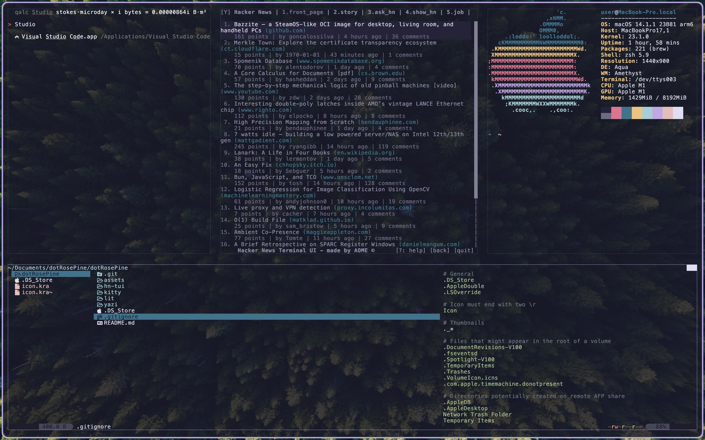

<h1 align="center">
   

   
  dotRosePineWoods
   
</h1>

<h4 align="center">A terminal-first dotfile set for MacOS and Linux/Unix, themed with <a href="https://rosepinetheme.com" target="_blank">Rosé Pine</a>.</h4>

  <a href="#overview">Overview</a> •
  <a href="#supported-tools">Supported Tools</a> •
  <a href="#how-to-use">How To Use</a> •
  <a href="#credits-and-thanks">Credits and Thanks</a> •
  <a href="#license">License</a>

> [!WARNING]  
> This repository is in early development and is incomplete.

## Overview

* Terminal-first focus
* Consistent cross-platform functionality and shortcuts
* Compatible with existing Rosé Pine <a href="https://rosepinetheme.com/themes/" target="_blank">themes</a>

## Supported Tools
* <a href="https://github.com/ohmyzsh/ohmyzsh/wiki/Installing-ZSH" target="blank">Zsh Shell</a>
* <a href="https://github.com/kovidgoyal/kitty" target="blank">Kitty Terminal</a>
* <a href="https://github.com/toadle/lit" target="blank">Lit Application Launcher</a>
* <a href="https://github.com/aome510/hackernews-TUI" target="blank">Hackernews-TUI News Browser</a>
* <a href="https://github.com/aome510/hackernews-TUI" target="blank">Yazi File Manager</a>

## How To Use

Each set of dotfiles is modular and includes a readme.md file to note any common modifications. Copy the files into your environment and edit as desired.

## Credits and Thanks

- [Rosé Pine](https://github.com/rose-pine/rose-pine-theme)
- Readme.md based on <a href="https://www.readme-templates.com">Readme-Template</a> by <a href="https://github.com/amitmerchant1990"> Amit Merchant</a>

## License

MIT